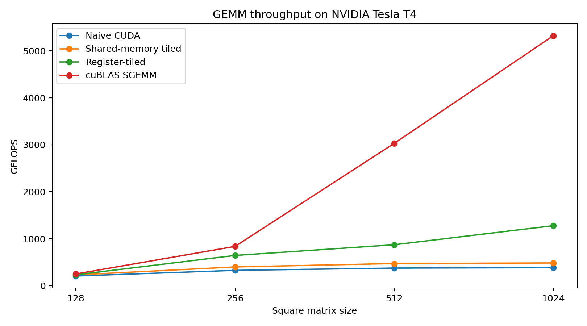
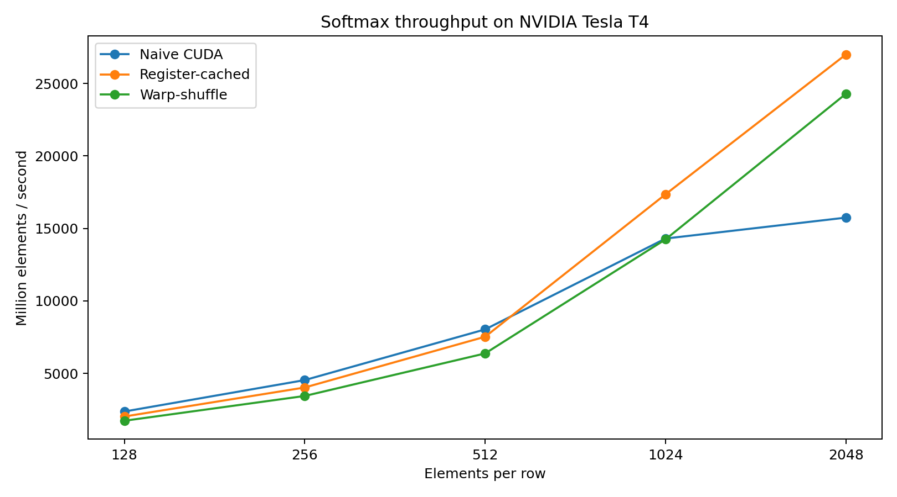

# CUDA Transformer Kernels

CUDA C++ implementations and performance analysis of two core transformer operations: **matrix multiplication (GEMM)** and **row-wise Softmax**.

The project focuses on iterative GPU optimization. Each implementation was validated for correctness, benchmarked for throughput, and profiled with NVIDIA Nsight Compute to identify bottlenecks and guide subsequent changes.

Benchmarks were run on an **NVIDIA Tesla T4, compute capability 7.5, with CUDA 12.8**.

## Highlights

### Matrix multiplication

The GEMM implementation progressed through:

1. Naive global-memory CUDA
2. Shared-memory tiling
3. Register tiling
4. Shared-memory padding to reduce bank conflicts
5. Comparison against NVIDIA cuBLAS SGEMM

At `1024 x 1024`:

| Implementation | Throughput |
|---|---:|
| Naive CUDA | 385.648 GFLOPS |
| Shared-memory tiled | 485.283 GFLOPS |
| Register-tiled + padding | **1278.508 GFLOPS** |
| cuBLAS SGEMM | 5322.721 GFLOPS |

The final custom kernel achieved:

- **3.31x** the throughput of the naive CUDA implementation
- **1.28 TFLOPS** FP32 throughput
- **24.0% of cuBLAS SGEMM throughput** at `1024 x 1024`



Full benchmark data: [results/gemm_t4.md](results/gemm_t4.md)

### Softmax

Three row-wise CUDA Softmax implementations were evaluated:

1. Naive block-level reduction
2. Register-cached implementation
3. Warp-shuffle reduction experiment

For 1024 rows with width 2048:

| Implementation | Throughput |
|---|---:|
| Naive CUDA | 15.746 billion elements/s |
| Register-cached | **27.003 billion elements/s** |
| Warp-shuffle | 24.291 billion elements/s |

Register caching achieved approximately **1.71x** the throughput of the naive implementation at width 2048.

The warp-shuffle implementation was retained in the repository even though it was slower. This demonstrates an important performance-engineering principle: a more sophisticated optimization is not automatically faster and should be evaluated empirically.



Full benchmark data: [results/softmax_t4.md](results/softmax_t4.md)

## Profiling-driven optimization

### GEMM

Nsight Compute showed that the shared-memory GEMM was not primarily limited by occupancy. Profiling instead exposed scheduler stalls and memory-pipeline pressure.

Register tiling increased arithmetic reuse and reduced the number of executed instructions.

Profiling the first register-tiled implementation then exposed shared-memory bank conflicts. Padding the shared-memory tile changed its stride and reduced excessive shared-memory wavefronts from approximately **32% to 3%** in the profiled kernel.

The optimization path was:

```text
Naive global-memory GEMM
        |
        v
Shared-memory tiling
        |
        v
Register tiling
        |
        v
Nsight Compute profiling
        |
        v
Shared-memory bank conflicts identified
        |
        v
Tile padding
        |
        v
Final register-tiled kernel
```

### Softmax

Nsight Compute identified long-scoreboard stalls associated with memory dependencies in the naive implementation.

The register-cached version keeps input values and intermediate exponentials in registers, reducing repeated global-memory traffic.

For the profiled 2048-wide workload:

| Metric | Naive | Register-cached |
|---|---:|---:|
| Issue-slot utilization | 42.75% | **63.36%** |
| Scheduler cycles with no eligible warp | 57.14% | **36.52%** |
| Eligible warps per scheduler | 0.74 | **1.40** |
| Warp cycles per issued instruction | 17.42 | **11.70** |
| Profiled kernel duration | 150.27 us | **85.12 us** |

A warp-shuffle reduction was then implemented and benchmarked. It did not outperform the register-cached implementation on the Tesla T4, so register caching was retained as the best-performing Softmax version.

## Benchmark methodology

GPU benchmarks use:

- CUDA events for timing
- warm-up execution before measurement
- 20 measured runs
- median execution time
- FP32 arithmetic
- CPU implementations as correctness references

All reported CUDA implementations passed correctness validation against the CPU reference.

Performance comparisons between CUDA implementations were measured on the same NVIDIA T4 benchmark session where possible.

CPU and GPU results should not be interpreted as direct hardware speedups because the CPU reference was developed and tested on a separate Apple system.

## Project structure

```text
cuda-transformer-kernels/
├── CMakeLists.txt
├── README.md
├── benchmarks/
│   ├── benchmark_matmul_cpu.cpp
│   ├── benchmark_matmul_cuda.cu
│   ├── benchmark_softmax_cpu.cpp
│   └── benchmark_softmax_cuda.cu
├── include/
│   ├── matmul.h
│   ├── matmul_cuda.h
│   ├── softmax.h
│   └── softmax_cuda.h
├── results/
│   ├── charts/
│   │   ├── gemm_t4.png
│   │   └── softmax_t4.png
│   ├── gemm_t4.md
│   ├── plot_results.py
│   └── softmax_t4.md
└── src/
    ├── matmul.cu
    ├── matmul_cpu.cpp
    ├── softmax.cu
    └── softmax_cpu.cpp
```

## Building

### CPU-only system

CUDA is optional in the CMake configuration, so the CPU implementations can be built on systems without an NVIDIA GPU.

```bash
cmake -S . -B build -DCMAKE_BUILD_TYPE=Release
cmake --build build -j
```

Run:

```bash
./build/benchmark_matmul_cpu
./build/benchmark_softmax_cpu
```

### NVIDIA GPU

For an NVIDIA Tesla T4:

```bash
cmake -S . -B build \
  -DCMAKE_BUILD_TYPE=Release \
  -DCMAKE_CUDA_ARCHITECTURES=75

cmake --build build -j
```

Run:

```bash
./build/benchmark_matmul_cuda
./build/benchmark_softmax_cuda
```

The GEMM CUDA benchmark also links against the CUDA Toolkit cuBLAS library.

## Implementations

### GEMM

`src/matmul.cu` contains:

- naive CUDA matrix multiplication
- shared-memory tiled matrix multiplication
- register-tiled matrix multiplication
- padded shared-memory layout to reduce bank conflicts

The CUDA benchmark also compares the custom implementations against `cublasSgemm`.

### Softmax

`src/softmax.cu` contains:

- naive block-level reduction Softmax
- register-cached Softmax
- warp-shuffle reduction Softmax

The current register-cached and warp-shuffle implementations support row widths up to **2048 elements** with the configured 256-thread block and eight cached values per thread.

## Key engineering lessons

This project demonstrates several CUDA performance principles:

- Shared memory reduces global-memory traffic, but access patterns matter.
- High occupancy alone does not guarantee high throughput.
- Register tiling can increase arithmetic reuse and reduce instruction overhead.
- Shared-memory bank conflicts can materially affect an optimized kernel.
- Profiler metrics are most useful when tied to specific code changes.
- Reducing memory traffic can be more valuable than optimizing reduction mechanics alone.
- Warp shuffles are not automatically faster than shared-memory approaches.
- cuBLAS provides a useful production-performance reference for custom GEMM kernels.
- Optimization decisions should be based on controlled benchmarks and profiling evidence.

## Tools

- C++17
- CUDA C++
- CUDA Runtime API
- cuBLAS
- CMake
- NVIDIA Nsight Compute
- Python
- Matplotlib

## Scope

This is a performance-engineering project intended to demonstrate CUDA kernel design, GPU memory reasoning, benchmarking, profiling, correctness validation, and empirical optimization.

It is not intended to replace cuBLAS or production transformer libraries.